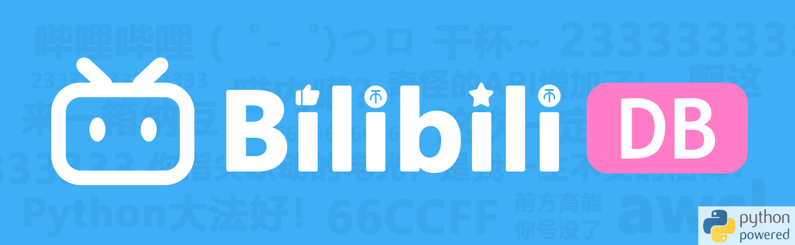

<div align="center">
<a href="https://github.com/Shadow403/BiliListener">
  
</a>
</div>

## 📖 简介
#### ✨ 一个B站直播监听程序 ✨
- 配置项: `Yaml`
- 数据库: `SQLite3`
- API框架: `FastAPI`

## 📚 使用方法
```bash
git clone https://github.com/Shadow403/BiliListener.git
cd BiliListener
pip install poetry
poetry config virtualenvs.in-project true
poetry install
```

## 📝 配置
- 修改 `config.yml` 下的 `auth.sessdata` 填入`填入已登录B站的 SESSDATA`

## 🍻 运行
- `pusher.py` 监听入口程序
- `worker.py` 接口入口程序

## 📦 打包
- `scripts` 目录下
  - `build_pusher.bat` 推送打包脚本
  - `build_worker.bat` 监听打包脚本

## 🎯 功能
- 入场
- 弹幕
- 礼物
- 上舰
- SC (醒目留言)

## 🧱 结构
```bash
BiliListener
 ├─app                      [监听程序]
 │  ├─config                [配置文件夹]
 │  ├─database              [数据库]
 │  ├─pusher                [监听检查]
 │  ├─worker                [监听WS]
 │  └─data                  [监听数据]
 ├─modules                  [项目依赖]
 │  └─blivedm (package)
 ├─scripts
 │  └─build_[scripts].bat   [打包脚本]
 └─web
    └─frontend              [前端]
```

## 💖 感谢
- [`xfgryujk/blivedm`](https://github.com/xfgryujk/blivedm)


## TODO ⏰

- [x] 打包该项目 📦
- [x] 支持配置文件 🛠️
- [ ] 掉线(数据不完整)标记 ☄️

<br>

<details>
<summary> 日志 </summary>

- `v0.1.0` 🎉 创世提交
- `v0.1.1` 🧱 监听异步支持
- `v0.1.2` ⚡ 接口优化
- `v0.1.3` ⚡ `ws` 断线重连后记录的数据恢复 | 添加 `ws` `LIKE_V3_UPDATE`
- `v0.1.4` ✨ 添加更多记录的数据 `config.json`
- `v0.1.5` ✨ 整体重构
- `v0.1.6` 📦 打包该项目 🐍 修复数据库 `Bugs`
- `v0.1.7` 🛠️ 支持配置文件
- `v0.1.8` 🛠️ 支持更多配置项 🐍 修复数据库 `commit.handle` `Bugs`
- `v0.1.9-b1` 🌐 添加前端
- `v0.1.9-b2` 📦 添加打包图标 `(ico)`
- `v0.1.9` 🛠️ 支持更多配置项 ✨ 添加重置直播状态 `24h` ✨ 添加 `api` 版本区分
- `v0.2.0-b1` ✨ 打包版本控制
- `v0.2.0-b2` ✨ API接口更新
- `v0.2.0-b3` ✨ API接口更新 🛠️ 添加权限 `strict`
